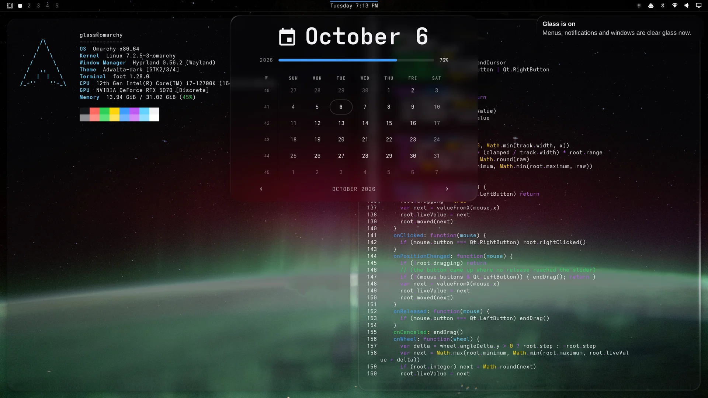
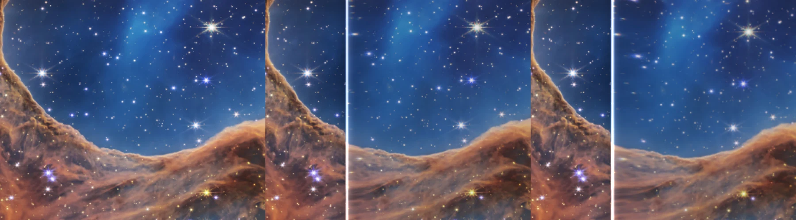
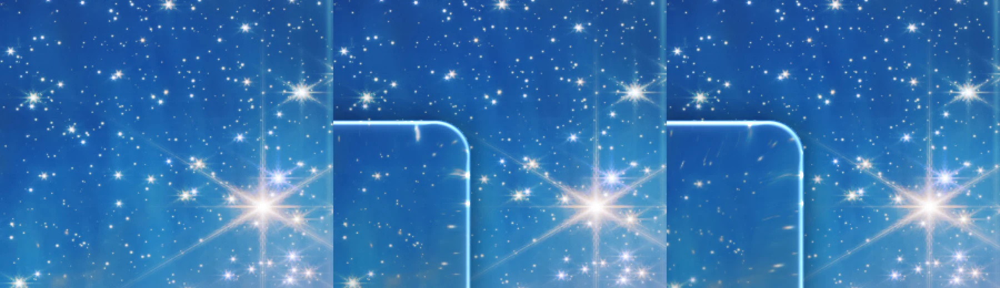
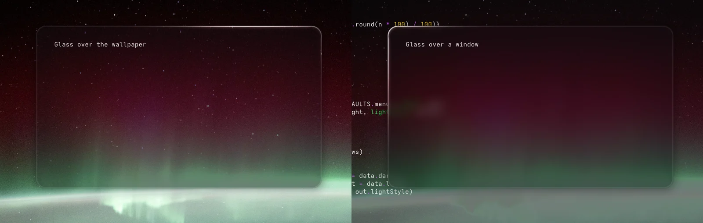
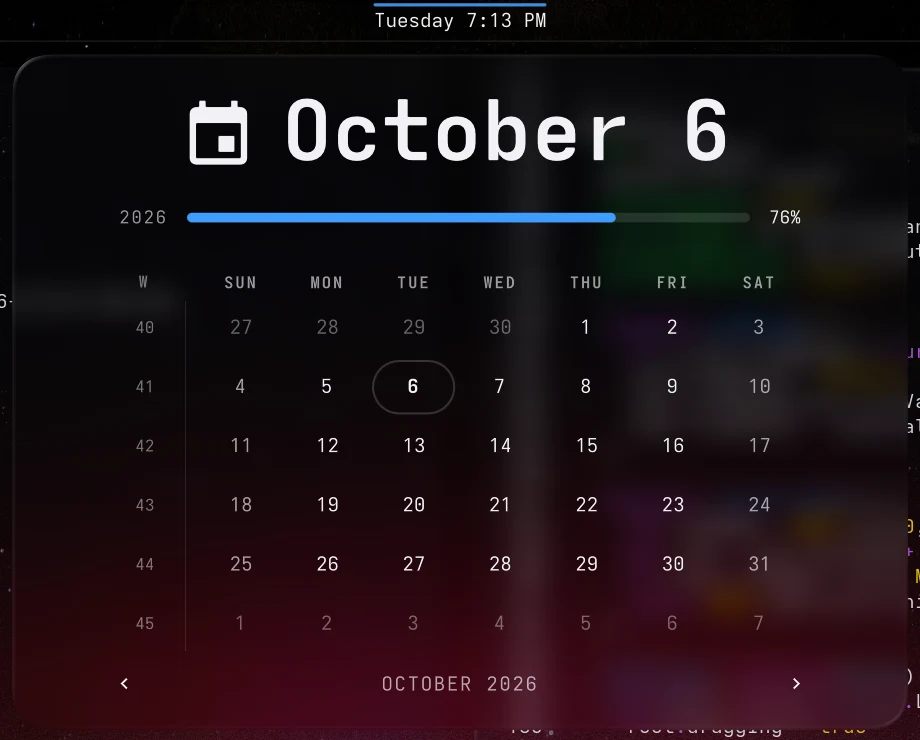
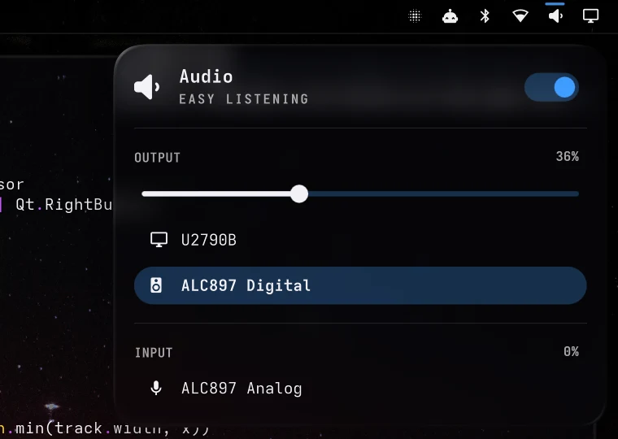
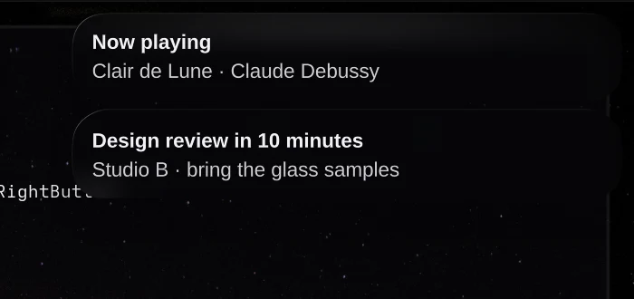
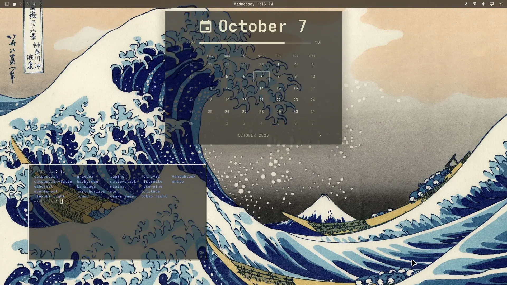
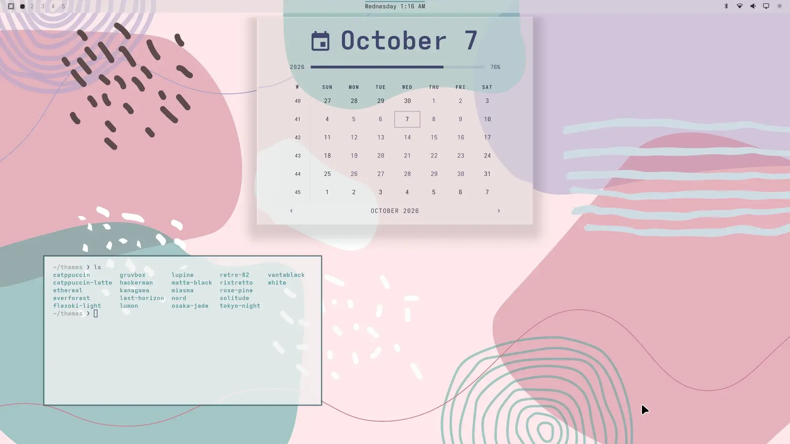
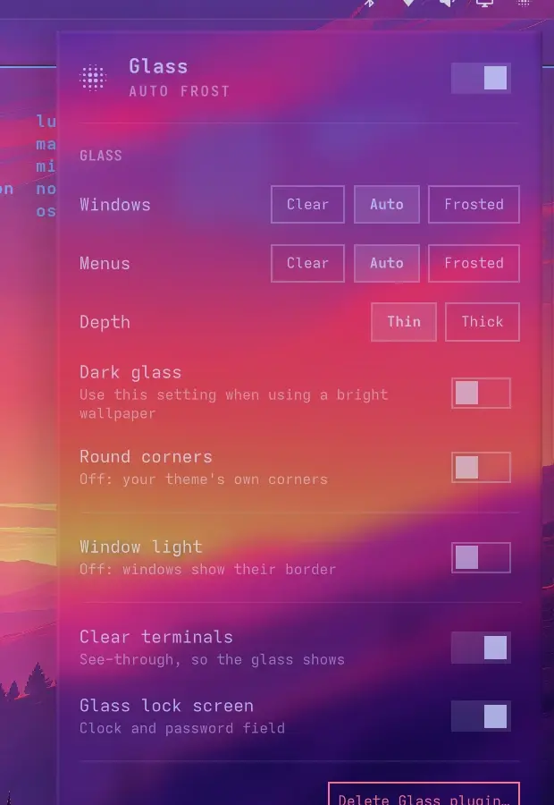

# True Glass for Omarchy

Real glass for your [Omarchy](https://omarchy.org) desktop. The bar, menus, notifications and windows become clear panes that bend what is behind them at their edges, split light into colour along the rim and catch a light from above. Menus flow out of the bar like liquid, and back into it. It works with any theme.

True Glass is built on [hyprglass](https://github.com/hyprnux/hyprglass) by Jeremy Trufier, the Hyprland plugin that renders the glass. True Glass adds the Omarchy side on top: glass shaped to each menu, the liquid motion, auto frost, the tints, the safety checks and a one-switch setup. Thank you, Jeremy, for making it open source.



**Demo videos:** [menus flowing out of the bar](https://github.com/Eddie175/omarchy-true-glass/releases/download/v1.0.0/hero.mp4) ·
[in slow motion](https://github.com/Eddie175/omarchy-true-glass/releases/download/v1.0.0/liquid-slow.mp4) ·
[menus switching, in slow motion](https://github.com/Eddie175/omarchy-true-glass/releases/download/v1.0.0/switch-slow.mp4) ·
[the edges up close](https://github.com/Eddie175/omarchy-true-glass/releases/download/v1.0.0/edges-closeup.mp4) ·
[auto frost](https://github.com/Eddie175/omarchy-true-glass/releases/download/v1.0.0/frost.mp4) ·
[on Omarchy's own themes](https://github.com/Eddie175/omarchy-true-glass/releases/download/v1.0.0/themes.mp4) ·
[the True Glass menu](https://github.com/Eddie175/omarchy-true-glass/releases/download/v1.0.0/glass-menu.mp4) ·
[Dark glass](https://github.com/Eddie175/omarchy-true-glass/releases/download/v1.0.0/dark-glass.mp4) ·
[Light glass](https://github.com/Eddie175/omarchy-true-glass/releases/download/v1.0.0/light-glass.mp4) ·
[notifications](https://github.com/Eddie175/omarchy-true-glass/releases/download/v1.0.0/notifications.mp4) ·
[window light](https://github.com/Eddie175/omarchy-true-glass/releases/download/v1.0.0/window-light.mp4) ·
[lock screen](https://github.com/Eddie175/omarchy-true-glass/releases/download/v1.0.0/lock.mp4)

## Install

From Omarchy's plugin marketplace, or:

```bash
omarchy plugin add https://github.com/Eddie175/omarchy-true-glass --enable
```

Then open the **True Glass** icon in the bar and flip the switch at the top of its menu. The first time, True Glass builds its engine for your Hyprland: about a minute, a few on an older computer. It builds at low priority, so you can keep working.

**Needs:** Omarchy with Hyprland 0.56, and the build tools from `base-devel` (most Omarchy installs have them; the menu says so if they're missing).

**Best on dark themes.** True Glass works with every Omarchy theme, square or round, dark or light, but its refraction shines most on dark ones. On a light theme, turn on **Light glass** in the True Glass menu, and set terminal apps to their light colours (in Claude Code, `/theme`).

## Remove

Turn it off with the same switch, or remove it completely with **Delete True Glass plugin…** in the menu, or:

```bash
omarchy plugin remove io.github.eddie175.true-glass
```

Either way True Glass first puts back everything it changed: it unloads its engine, makes your bar opaque again if it made it transparent, gives your theme its outlines back, takes its one line back out of your terminal configs and selects your previous lock screen design again. Nothing else on your system is touched, and nothing is left behind.

## What you get

### The edges



*Left to right: the wallpaper alone, Thin glass and Thick glass, magnified. Inside the pane the picture is untouched; at the rim the stars stretch and the cliff edge bends as the glass curves away.*

Every pane is a lens. Each pixel follows the eye ray through a curved rim with Snell's law, so the picture behind bends and wraps round the edge of the glass, magnified as it goes. Each colour bends a little differently, so bright edges split into a faint rainbow. The rim mirrors the scene around it, and one thin edge catches a light from above. The curve rolls smoothly into the flat top, so there's no hard line where the bend starts.



### Clear enough to forget it's there



True Glass doesn't frost or tint by default. Over your wallpaper the middle of a pane is perfectly clear: the picture shows through untouched, and only the rim bends it. **Auto** frosts a pane only where a window is behind it, so text behind never fights text in front, and clears it again when the window moves away. Window glass and menu glass each have **Clear**, **Auto** and **Frosted**.

### Menus flow out of the bar



Click a bar item and its menu grows out of the bar like a drop of liquid, joined to it by a neck that thins and lets go. Closing pours it back in. Switch straight from one menu to another and the glass flows from one shape into the next.

With Hyprland's animations turned off, True Glass follows: menus fade in and out where they are, and the window light holds still.

### Everything in the shell is glass

<p>


</p>

The bar, every menu, notifications, tooltips, the volume and brightness display, the clipboard, the emoji picker and password prompts. The glass follows each card's own outline, and keeps text readable: the theme's card colour becomes a light tint, and labels get a soft dark backing where the picture behind is bright.

### Dark glass and Light glass



**Dark glass** (dark themes) is smoked glass for bright wallpapers: what shows through is darkened, bright pictures the most and dark ones only a little, keeping their colour, so light text reads on anything.



**Light glass** (light themes) is milky white glass: whatever is behind is lifted into the light range, so a light theme's dark text reads over any wallpaper or window. The menu offers the one that fits your theme, and each remembers its own setting as you switch themes.

### Window light

The window you're in is marked by a light on its glass instead of a painted border: **Comet** (a streak gliding round the edge), **Twin** (two streaks), **Halo** (a long soft arc), **Outline** (the whole edge lit, brightest toward the light), **Aura** (the whole edge with a soft crest going round) or **Prism** (a slow light that splits into colour where it catches the edge).

### More in the menu



- **Depth:** Thin or Thick glass. Thick bends more at the rim and casts a deeper shadow.
- **Low power:** for older or low-power computers (see below).
- **Round corners:** True Glass matches your theme's corners (Omarchy's own themes are square, and their glass corners are cut like a glass block). Turn this on to round windows, menus and buttons instead.
- **Clear terminals:** makes Ghostty, Kitty, Alacritty and Foot see-through so the glass shows behind your text. It adds one marked line to each terminal's config while it's on.
- **Glass lock screen:** with the [Lock Designs](https://github.com/smoothpixels/omarchy-lock-designs) plugin, the clock and password field on your lock screen are glass too.

Changes apply instantly.

<br clear="right">

## What True Glass changes

While True Glass is on:

| What | Where | When you turn it off |
|---|---|---|
| The glass engine, loaded into Hyprland | built in `~/.local/share/omarchy-glass/` | unloaded; deleted with the plugin |
| Its settings | `~/.local/state/omarchy-glass/` | kept; deleted with the plugin |
| The bar made transparent, if it wasn't | Omarchy's own setting | set back |
| No outlines round menus, tooltips and notifications, and no full-screen dim behind the menu, launcher and password prompts | a marked block in `~/.config/omarchy/shell.toml` | removed |
| Round corners (only if you turn it on) | Hyprland's corner rounding, at runtime | your theme's corners back |
| One line per terminal config (Clear terminals only) | `~/.config/ghostty/config`, `kitty/kitty.conf`, `foot/foot.ini`, `alacritty/alacritty.toml` | removed |
| The True Glass lock design (Glass lock screen only) | `~/.config/omarchy/lock-designs/` | removed, your previous design selected again |

True Glass never edits your Hyprland config or Omarchy's files. Its window and layer rules are applied at runtime and disappear when Hyprland reloads its config without True Glass.

## Fast and light

- **Still screen:** nothing is redrawn. True Glass caches every pane and only works while something moves behind or in it. The one exception is a moving window light, which redraws the window's edge as it goes round; Outline holds still.
- **While things move:** about 0.4 ms of GPU a frame with a menu pouring out of the bar, about 0.17 ms dragging a glass window (measured at 2560×1440 on an RTX 5070).
- **CPU:** a fraction of a millisecond a frame, only while things move. **Memory:** about 7 MB. **Disk:** about 3 MB.
- **Low power**, for older computers: clear, thin glass without the window light, the picture behind sampled at half resolution, no colour split or rim reflection. It cuts the GPU work by 15–40 %. True Glass turns it on by itself on Intel graphics from 2015 to 2020; you can switch it either way in the menu.

## Safe on any machine

True Glass checks your graphics before it turns on. With no GPU driver (software rendering) it stays off. On older graphics (Intel from before 2015, the open-source nouveau driver, older AMD cards and virtual machines) it stays off by default, because a GPU hang there takes Hyprland down; the menu offers to try anyway, in Low power. If its shaders don't build on your GPU, it unloads itself and says so in the menu, with nothing else changed. And if Hyprland ever crashes while True Glass is loaded, True Glass stays off at the next login and tells you, so a problem can never repeat at every login.

## Updating Hyprland

The engine is built for the Hyprland you run. After a Hyprland update, True Glass keeps working with the engine already loaded; the next time you log in, it builds a new one for the new version (about 40 seconds, shown in the menu). If a new Hyprland isn't supported yet, the menu says so and the glass stays off until True Glass is updated.

## Credits and licenses

**Engine.** Based on [hyprglass](https://github.com/hyprnux/hyprglass) by Jeremy Trufier, under the BSD 3-Clause License (`engine/LICENSE`). Its cubic-bezier solver is a port of WebKit's UnitBezier (BSD 2-Clause, Apple Inc.); its license text is in `THIRD_PARTY_NOTICES.md`. Everything else in this repository is under the MIT License (`LICENSE`).

**Screenshots.** Most screenshots and videos use the wallpapers that come with Omarchy's own themes. The others are public domain or CC BY 4.0: [Cosmic Cliffs](https://esawebb.org/images/weic2205a/) (NASA, ESA, CSA, and STScI), The aurora borealis blankets the Earth (NASA), [*Twilight in the Wilderness*](https://www.clevelandart.org/art/1965.233) by Frederic Edwin Church (The Cleveland Museum of Art, CC0), [The Lagoon Nebula](https://esahubble.org/images/heic1808a/) (NASA, ESA, STScI) and *The Great Wave off Kanagawa* by Katsushika Hokusai (public domain). None of them is included in True Glass.

**Fonts.** The lock screen uses Adwaita Sans (SIL Open Font License), which ships with Omarchy; no font files are included.

## Trademarks and independence

True Glass is an independent project. It is not affiliated with, endorsed by, sponsored by or connected to Apple Inc. "Apple", "Liquid Glass", "iOS" and "macOS" are trademarks of Apple Inc.; they are not used in this project's name, assets or user interface (source comments mention Apple only to credit the WebKit code above or to describe standard timing curves).

No Apple software, artwork, icons, wallpapers, fonts, sounds, shaders or other assets are included in or were extracted for this project. The one piece of Apple-authored source is WebKit's open-source, BSD-licensed timing-curve solver, ported into the engine with its license. The glass is rendered from first principles: Snell's law refraction, Cauchy dispersion, Schlick's Fresnel approximation and signed distance fields, all public, textbook physics and mathematics. The motion uses damped spring equations, likewise standard physics.

Omarchy and Hyprland are the work of their respective projects; True Glass is a third-party plugin for them and is not an official part of either.

## License

MIT, except where noted above (the engine is BSD 3-Clause). See `LICENSE`, `engine/LICENSE` and `THIRD_PARTY_NOTICES.md`.
